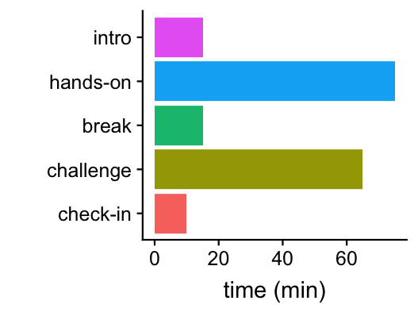
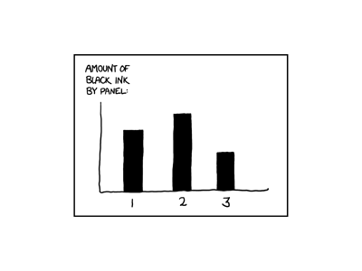

```{r knitr-options, echo=FALSE}
knitr::opts_chunk$set(comment = "#",collapse = TRUE,results = "hide",
                      fig.show = "hide", message = FALSE,warning = FALSE)
```

2. Tutorial outline
===================




3. Overlap with "Advanced Computing, Part 1"
============================================

+ Some inevitable overlap.

+ Here we take a more careful look at ggplot2, and data visualization
  strategies in general.

4. Why plot?
============

1. To gain insight into your data ("exploratory data visualization").

2. To tell a story (e.g., for a scientific publication).

Both 1 & 2 are usually *iterative* and *repetitive*. Therefore, you
need to develop skills to *efficiently* create & refine plots.

5. The programmatic approach
============================

We will take the *programmatic approach* to data visualization, which
will allow us to...

+ Create an endless variety of plots.

+ Expand possibilities by installing new R packages.

+ Reuse code to quickly create sophisticated plots---*automation is
  your friend*!

+ **ggplot2** is (currently) the preferred approach to creating plots in R.

6. Tutorial aims
================

1. Get hands-on experience with the basic elements of data visualization
   in R.

2. Learn how to interpret & build on someone else's R code for creating
   plots using ggplot2.

3. Build on some of the skills you learned in the previous tutorials.

4. Learn through "live coding"---this includes learning from our
   mistakes!

#7. The hands-on exercise

+ We will use someone else's R code to create some plots.

+ To achieve our aims, we will need to make some changes to the code.

+ First, we will step through the code to learn how it works.

8. Initial setup
================

+ WiFi.

+ Power outlets.

+ Pace & questions (e.g., keyboard shortcuts).

+ Reading what I type.

+ Tutorial packet (**this has been updated**).

+ TAs.

+ Locating your team.

+ Clean up computer clutter.

+ Posture.

9. Materials for the hands-on exercise
======================================

+ **slides.pdf:** These slides.

+ **slides.Rmd:** R Markdown source used to generate these
  slides. *Copy and paste code from this file.*

+ **handout.pdf**: Tutorial handout.

+ **handout.Rmd:** Markdown source used to generate the tutorial
  handout.

+ **Food_Inspections.csv.gz:** Food Inspection data downloaded
  from the Chicago Data Portal.

+ **pizzaplots.R:** R code used in hands-on exercise.

+ **communitymap_nov2016.pdf:** City of Chicago Police Community Areas Map.

10. Software we will use in this tutorial
=========================================

1. **R** and/or **RStudio**.

2. R packages **ggplot2**, **cowplot** & **readr**.

# 11. Run `sessionInfo()`

Check the version of R that you are using:

```{r check-version}
sessionInfo()
```


12. Clear your R environment
============================

The R environment is where all variables (and functions) are stored and
accessed. You should start with an empty environment. Run this:

```{r check-env}
ls()
```

If this outputs names of objects, it means your environment is not
empty, and you should restart R with a clean environment. Do either:

+ `rm(list = ls())`.

+ Or, in RStudio, **Session > Clear Workspace**.


13. A test plot
===============

To test that your R environment is properly set up, let's plot some
fuel economy data from the EPA:

```{r first-plot}
library(ggplot2)
epa <- read.csv("epa.csv")
ggplot(mpg,aes(displ,cty,color = class)) +
  geom_point()
```

Did it work? Later we will understand what this code does.


14. Hands-on exercise
=====================

1. *Read description from handout.*

2. Open source file, **pizzaplots.R**.

3. Make sure your working directory is the same directory containing
   the tutorial materials; use `getwd()` to check this.

# 15. Set up your R environment for the analysis

If you haven't already done so, install the packages we will use:

```{r install-pkgs, eval=FALSE}
install.packages("readr")
install.packages("ggplot2")
install.packages("cowplot")
```

Once installed, *load* the packages:

```{r load-pkgs}
library(readr)
library(ggplot2)
library(cowplot)
```

16. Load the Food Inspection data
=================================

Use `read_csv` from the **readr** package to load the data into a "data
frame":

```{r load-data}
data.file  <- "Food_Inspections.csv.gz"
dat        <- read_csv(data.file)
class(dat) <- "data.frame"
```


Check that the data were read correctly, and inspect the table:

```{r inspect-data}
nrow(dat)
ncol(dat)
names(dat)
summary(dat)
object.size(dat)
```


17. Keep some columns, and rename them
======================================

```{r remove-columns}
cols     <- c(2:5,7,8,11,13,15,16)
colnames <- c("dba","aka","license","type",
              "address","city","date",
              "results","latitude","longitude")
dat        <- dat[cols]
names(dat) <- colnames
```


18. Extract year from inspection date
=====================================

```{r extract-year}
get.third.entry <- function(x) { return(x[3]) }
out      <- strsplit(dat$date,"/")
dat$year <- sapply(out,get.third.entry)
dat$year <- as.numeric(dat$year)
```


19. Filter inspections
======================

```{r filter-rows} 
dat <- subset(dat,
              type == "Restaurant" &
              city == "CHICAGO" &
              !is.na(latitude) &
              !is.na(longitude) &
              !is.na(license))
```


20. Extract pizza restaurant inspections
========================================

As before, we use `subset` to filter out inspection records. To be
prudent, create a new data frame, "pdat" (short for "pizza data"):

```{r get-pizza-data}
pdat <- subset(dat,
  grepl("pizz",dba,ignore.case = TRUE) |
  grepl("pizz",aka,ignore.case = TRUE))
```


21. Sort rows & keep unique license entries
===========================================

First, sort the rows of the table by year of inspection:

```{r sort-rows-by-year}
rows <- order(pdat$year)
pdat <- pdat[rows,]
```


The idea is that the each "license" should correspond to a restaurant.
After this step, there should be one row per pizza location:

```{r select-unique-licenses}
rows <- which(!duplicated(pdat$license))
pdat <- pdat[rows,]
```


22. Our first plot: new pizza places by year
============================================

Our first plot is a bar chart of the estimated number of new pizza
restaurants by year. Use `table` to create a table containing number
of newly inspected restaurants by year:

```{r count-inspections-by-year}
counts <- table(pdat$year)
```

To plot these counts in ggplot2, we need to create a data frame:

```{r convert-counts}
counts <- as.data.frame(counts)
names(counts) <- c("year","count")
```

We now have a data frame with two columns, "year" and "count". *Let's
plot it!*

23. Our first plot... finally!
==============================

Specify the data frame, and the mapping between variables (columns)
and plotting elements:

```{r create-barchart-1}
aes1 <- aes(x = year,y = count)
p1   <- ggplot(counts,aes1)
```

Specify *how* to plot the data points:

```{r create-barchart-2}
out <- geom_col(width = 0.5)
p1  <- ggplot_add(out,p1)
```

24. But where is the plot?
==========================

Variable `p1` is a "ggplot" object. Internally, it is very
complicated, so you don't want to manipulate it directly:

```{r create-barchart-3}
class(p1)
attributes(p1)
```

The `print` function tells R to draw the plot to the screen:

```{r create-barchart-4}
print(p1)
p1
```


25. The essentials of ggplot2
=============================

All plots in ggplot2 require these three elements:

1. A data frame.

2. An "aesthetic mapping" that declares how columns are mapped to plot
   features (axes, shapes, colors, *etc.*).

3. A "geom", short for “geometric object,” that specifies the type
   of plot.

All plots are created by *adding layers.*

26. Adjusting the plot
======================

Let's improve the y-axis label:

```{r create-barchart-5}
out <- labs(y = "number of locations")
p1  <- ggplot_add(out,p1)
```

*All plot adjustments are also "layers".*

27. Your first challenge
========================

Sometimes lines are more effective than bars for highlighting
trends. If you wanted to show the trend as a line plot, how would you
change the code to do this?

28. Alternative ggplot2 syntax
==============================

Here is equivalent code that is more concise (and more commonly used),
but also more difficult to understand because it is less clear what
the "+" does:

```{r create-barchart-6}
p1 <- ggplot(counts,aes(x = year,y = count)) +
  geom_col(width = 0.5) +
  labs(y = "number of locations")
```


29. Our second plot
===================

The second plot is far more interesting, and no less difficult to
create *now that we have carefully prepared the data*. First, we
specify the data frame, the mapping, and what to plot:

```{r create-map-1}
aes2 <- aes(x     = longitude,
            y     = latitude,
            color = year)
p2   <- ggplot(pdat,aes2)
out  <- geom_point(shape = 20)
p2   <- ggplot_add(out,p2)
```


30. Adjusting the colour mapping
================================

This code chunk adjusts the way that the years are mapped to colours:

```{r create-map-2}
out <- scale_color_gradient2(low = "skyblue",
         mid = "white",high = "orangered",
		 midpoint = 2014)
p2  <- ggplot_add(out,p2)
```

All functions starting with `scale_` modify the behaviour of the
geoms.


31. Combining the plots
=======================

With cowplot, this is easily done:

```{r combine-plots}
p12 <- plot_grid(p1,p2,labels = c("A","B"))
```

In **pizzaplots.R**, the `theme_cowplot` function is used to adjust
the size of the text.

32. Save your plot
==================

PNG is a commonly used format to share images.

```{r save-plot}
ggsave("plots.png",p12,dpi = 150)
```

33. Re: plots for report
========================

```
I was able to generate the plots using the
R code. Please see attached. Are these the
plots you were expecting for the paper?
```

34. Re: plots for report
========================

```
Great work, and quick turnaround. These
plots look fantastic. However, I would like
one change to better present the story I
would like to tell: color the bars so that
they match the colors in the map. Also, a
PNG won't work for the report. Please send
me a PDF instead. Thanks.
```

35. Follow-up challenge
=======================

These improvements are left as a programming challenge---see the
handout:

1. Add color to the bar chart.

2. Save the combined plot as a PDF.

# 36. Automating plot creation

Instead of stepping through the code line by line, we can run all the
code at once, which should automate all the steps of the analysis and
plotting:

```{r automate-plots, eval=FALSE}
source("pizzaplots.R")
```

In RStudio, there are buttons to do the same thing.

# 37. Some take-home points

+ Preparing data is tedious. Data preparation is sometimes >90% of the
  effort! *Many analysis mistakes are due to poor data preparation.*

+ Creating sophisticated plots using ggplot2 requires relatively
  little effort *provided the data are in the right form.*

+ We illustrated some of the benefits of the *programmatic approach*.

+ All plots in ggplot2 have these three elements:

    1. A data frame.

    2. An "aesthetic mapping" that declares how columns in the data
       frame are mapped to plotting features (axes, shapes, colors,
       *etc.*).

    3. A "geom", short for “geometric object,” that specifies the type
       of plot.

+ Plots are created by combining "layers" using `ggplot_add` or the +
  operator.

38. Some Best Practices we illustrated
======================================

1. Record your analysis and plotting steps in a file so you can
   reproduce them later.

2. Take advantage of great packages! (Ask others what packages they use.)

3. Use pixel formats (e.g., GIF, PNG, JPEG) for exploratory work, and
   vector formats (e.g., EPS, PDF) for publication-ready figures.

# 39. An xkcd bar chart

From http://xkcd.com/688:



40. Main programming challenge
==============================

+ Gain insight into biological data using simple visualizations.

+ DATA: behavioral tests, physiological trait measurements, and
  genotypes from an outbred mouse population.

+ GOAL: understand the genetic contributions to behaviour and
  musculoskeletal traits in mice.


41. Data used in programming challenge
======================================

All data are stored in CSV files:

+ **pheno.csv:** Various traits measured in 1,219 CFW mice. We will
  explore a few of the columns in this table.

+ **hmdp.csv:** BMD measurements taken in 878 HMDP mice. Used to
  compare against BMD in CFW mice.

+ **gwscan.csv:** Results of a genome-wide scan for abnormal BMD.

+ **geno_rs29477109.csv:** Genotypes at one SNP in 1,038 CFW mice.

42. Overview of main programming challenge
==========================================

+ **Part A:** You will use plots to explore features of the data, and
  relationships between different types of data.

+ **Part B:** You will use plots to learn about bone-mineral density
  in the mouse population.

+ **Part C:** You will use plots to summarize the results of a
  genome-wide association study of BMD, identify possible genetic
  determinants of BMD, and examine closely the relationship between
  genotype and BMD.

43. Hints for main programming challenge
========================================

+ Some "geoms" you may find useful: `geom_point`, `geom_histogram`,
  `geom_boxplot`.

+ It may be useful to transform some columns to *factors*.

+ More hints are given in the programming challenge text.

+ Coming up with the answers will involve skills other than
  programming, so collaborate!
