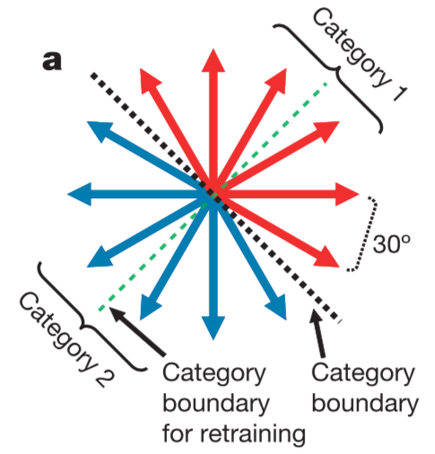
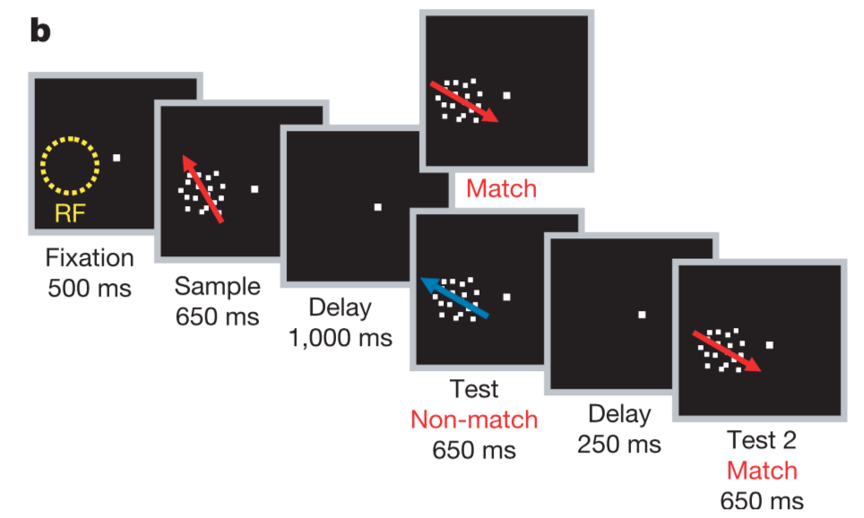
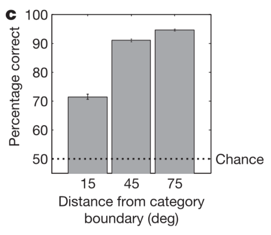
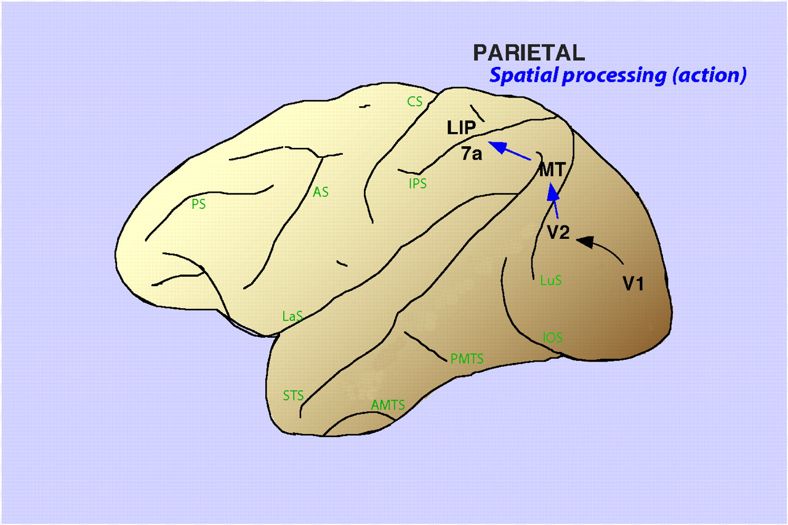
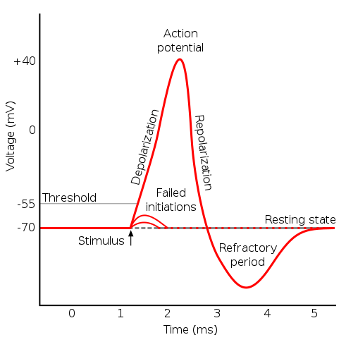

```{r knitr, echo=FALSE}
knitr::opts_chunk$set(
  eval      = TRUE,
  comment   = "#",
  results   = "hold",
  # collapse  = TRUE,
  fig.align = "center")
```


## Installation notes
For this tutorial, relatively up-to-date versions of `R` and `RStudio` are needed. To install `R`, follow instructions at [`cran.rstudio.com`](https://cran.rstudio.com/). Then install `Rstudio` following the instructions at [`goo.gl/a42jYE`](https://www.rstudio.com/products/rstudio/download2/). Download the `ggplot2`, `stats`, `plyr`, and `rmatio` packages. 

# Welcome
Understanding the detailed workings of the brain is one of the grand challenges in modern biology. While we have learned quite a bit about the brain in the 100 years or so since Golgi and Ramon y Cajal first revealed its neural-cellular microstructure, we still have yet to fully "crack the code" this marvelous piece of tissue uses to generate complex actions, feelings, memories, and thoughts. This workshop will demonstrate a simple computation performed by neurons in two different regions in the brain of the Rhesus macaque. It will illustrate how information is transformed when moving from sensory representations -- in this case, motion direction -- to more abstract, cognitive representations -- in this case, categorization of motion direction into two clusters: up and to the right, and down and to the left. 

# Neural encoding
To solve complex tasks, the brain must often interpret continuous sensory stimuli according to some non-physical or abstract discrete category membership. Thus, both quantities (a sensory and a categorical representation) are likely to be represented in the brain. Here, we will investigate one such transform and evaluate data from both before and after it has begun. As noted, we'll be exploring this question in the context of the transformation of a visual motion signal. We'll explore how different brain areas encode something like a stimulus variable (the direction of motion of the visual object) versus something closer to a stimulus motion category (like "up" or "down"). 

## The task
To investigate how visual information is transformed from a (roughly) continuous representation to a discrete, categorical representation, we need to ask the subject to perform a task that relies on that transformation. 

Here, we'll use data originally published in Freedman and Assad (2006) *Nature*, in which they train two Rhesus macaques to categorize a visual motion stimulus according to an arbitrary category boundary, as here:

```{r category, echo=FALSE, fig.cap="A schematic of the category boundaries (both original and retrained) used in the delayed match-to-category (DMC) task, see below. Taken from Freedman and Assad (2006).", out.width="33%"}

```

The motion stimulus is a patch of dots that move across the screen. They are placed at random positions within a small region in visual space, but all move in the same direction. The region in space where the dots appear on the screen is fixed, but the direciton of motion of the dots varies from trial-to-trial. The subject is asked, during a particular trial, to view the motion of an initial dot patch, then report whether or not it matches a second moving dot patch.

Specifically, the subjects are performing a delayed match-to-category (DMC) task with the following structure: 

1. They fixate in the center of a computer screen.  
2. A motion stimulus in one of the 12 directions, the sample, is played.  
3. There is a delay period of 1 second.  
4. A second motion stimulus, the test, is played. If its category is the same as the first motion stimulus, the subject must release a lever -- otherwise, they continue to hold the lever. If the lever release is correct, they receive a juice reward.
5. If the subject was supposed to continue holding the lever, there is a second delay followed by a third stimulus which always matches the category of the first stimulus -- the subject must then release the lever to receive juice.  

```{r task, echo=FALSE, fig.cap="A schematic of the task described below. The stimuli are coherent patches of dot motion and RF indicates the receptive field of a recorded neuron. Taken from Freedman and Assad (2006).", out.width="75%"}

```

We will focus primarily on step 2 of the task. Even though this task seems fairly complicated, the subjects can perform well at it with sufficient training -- and their errors follow the pattern one might expect: They make more errors when performing categorizations that are close to the category boundary, but perform well-above chance at all distances far from the boundary. 

```{r bhv, echo=FALSE, fig.cap="The average performance of the two subjects on the DMC. Taken from Freedman and Assad (2006).", out.width="40%"}

```

We have in hand our task that requires the process that we are interested in, the categorization of motion direction of the dot patch. But, now, how do we study this in the brain? Or, perhaps more immediately, *where* do we study it in the brain?

## The brain regions of interest
The middle temporal area (MT) is believed to be the first higher brain area with robust representations of visual motion. MT neurons display "tuning" to motion direction, meaning that they have a preferred direction that they respond to most vigorously, and lesser responses to other directions. By monitoring the responses of many MT neurons, one can read out the direction of the visual stimulus. MT is also part of the canonical dorsal visual stream, which is thought to primarily underly the allocation of visual attention and spatial processing. MT has been shown to be necessary to perform a similar categorization task, however, MT is thought to provide a more sensory (or literal) representation of motion direction, rather than representing more abstract category membership, so it can't be the end of the road for this neural computation. 

The next brain area after MT in the dorsal stream is posterior parietal cortex (PPC) a complex of regions including the lateral intraparietal area (LIP). LIP is known to display a range of representations of task variables including those aligned with a subject's upcoming behavioral choice and with memories of past visual stimuli.

```{r anatomy, echo=FALSE, fig.cap="A schematic of the canonical dorsal visual stream overlaid on the Rhesus macaque brain. Adapted from Sereno and Lehky (2007).", out.width="50%"}

```

How does representation of visual motion while a subject is performing our categorization task differ between MT and LIP? What are some hypotheses that one could test? 

## Spiking: the substrate of neural communication
Neurons in the brain communicate through the firing of action potentials, a short (~1ms long) spike in electrical depolarization that travels down the axon and releases a chemical signal at the synpase that opens ion channels in the downstream cell. 

```{r spike anatomy, echo=FALSE, fig.cap="A schematic of an action potential or 'spike' from a neuron.", out.width="50%"}

```

Understanding how the brain functions involves catching this electrical activity in action and recording from neurons while the subject receives sensory inputs, makes decisions, and reports those choices behaviorally. 

One of the most common neural recording techniques is called extracellular electrophysiology, which can be performed in awake and behaving subjects. With this technique, an experimentalist is able to record single spikes from single neurons in an anatomically targeted region of the brain. While techniques exist now for recording modestly sized groups of neurons (e.g. up to 100 or 1000), the dataset we are using today is from 2006, and all of the recordings are from single neurons, recorded independently of one another. 

This technique has high temporal resolution (i.e., we are recording single spikes) and high spatial resolution (i.e., we are recording from single cells), and current engineering efforts focus on attaining this kind of space-time resolution while recording from tens of thousands of cells, or perhaps the entire brain of a smaller organism. Here, we have the benefit of decades of neuroanatomy that let's us pinpoint regions in the brain that display evidence of a concrete neural computation in the response of single cells. 

We will now examine spikes from a many neurons in both MT and LIP. We want to understand how their representations of visual motion direction and (potentially) visual motion category differ. Let's get started! 

# The spiking of an MT neuron
First, we need to load our dataset, which has been saved in the MatLab data format (for which we can use the library "rmatio" to import into R). Let's start by loading the data for one particular cell: 
```{r load}
library(rmatio)

mt_neuron_folder <- '../data/MT/'
mt_neuron_path <- '../data/MT/dseao01.mat'

mt_neuron <- read.mat(mt_neuron_path)
```
Now, let's examine what's happening in this data structure:
```{r mt_summary}
str(mt_neuron)
```

We can see that the data is in a named list format and the list has three elements:  
    - **trial_raster:** An array of dimensions 246 and 2700. This is the spike "raster" for our MT neuron. There are 246 trials and each trial is segmented into 2700 bins, each 1 ms in size. The value of each bin is 0 if no spike was recorded from this neuron at that time point, and 1 if a spike was recorded. The visual motion stimulus appears 500 ms into the trial, at element 500.   
    - **samp_direction_this_trial:** This is the direction in degrees of the first visual motion stimulus. Since MT neurons are thought to be tuned to visual motion, we might expect them to vary their responses with changes in direction.  
    - **test_direction_this_trial:** We will largely ignore this here, but it is the direction of the second visual motion stimulus.  
    
We can begin to visualize the response of this neuron by creating a "raster plot" where the times of spikes in each trial are marked by a dash or circle, and trials are aligned and stacked along the y-axis.

>
> **Exercise 1**: Make a raster plot for the MT neuron we loaded earlier.
>
>

```{r raster_plot, out.width = '65%'}

library(ggplot2)

# the stimulus starts 500ms after the beginning of each trial
stim_onset = 500

mt_raster <- mt_neuron[['trial_raster']]

# Find all the (time bin, trial) pairs in which there were spikes. 
# We'll use the `which` function to find the values where the raster 
# contains spikes (a value of '1' in the raster matrix), and we'll use 
# `arr.ind` (which means 'array indices') to report back where in the 
# matrix those values of '1' were found.

spkpairs = which(mt_raster == 1, arr.ind=TRUE)
qplot(spkpairs[ , 2] - stim_onset, spkpairs[ , 1], 
      xlab='time from stimulus onset (ms)',
      ylab='trial')

```

This gives us the overall structure of the trial. We get a response to the first or "sample" stimulus, relatively less firing during the delay period, followed by a strong response to the second, or "test" stimulus. In each trial, a different motion direction was shown, and these were pseudo-randomly interleaved (i.e. not in any particular order in direction space). We would expect, based on what we just learned about area MT, that the neuron will be tuned to its particular favorite direction... so, let's sort this raster by motion direction!

>
> **Exercise 2**: Color the raster plot by the motion direction of the first or "sample" direction. You'll want to grab the sample directions for each trial from the data structure `mt_neuron` and its component `samp_direction_this_trial`. You can try coloring each trial by its direction first, then sort those direction into clusters so you can plot them in contiguous rows.
>
>

```{r single_dir, out.width='65%'}
dirs <- mt_neuron[['samp_direction_this_trial']]

unique_dirs <- unique(dirs)
print(unique_dirs)
choose_dir <- 240

dir_raster <- mt_raster[dirs == choose_dir,]
dir_spks <- which(dir_raster == 1, arr.ind=TRUE)
qplot(dir_spks[ , 2] - stim_onset, dir_spks[ , 1], 
      xlab='time from stimulus onset (ms)',
      ylab='trial')

```


There are many ways to create this plot, but here is some code that succintly creates a nice colored raster plot, using the `factor` function in `R`:

```{r sorted_raster, out.width = '65%'}

sort_dirs <- sort(dirs, index.return=TRUE)
order_inds <- sort_dirs$ix
s_dirs <- sort_dirs$x

ordered_raster <- mt_raster[order_inds, ]
sorted_spkpairs <- which(ordered_raster == 1, arr.ind=TRUE)

dfact <- factor(s_dirs[sorted_spkpairs[, 1]], levels=unique(s_dirs))

qplot(sorted_spkpairs[ , 2] - stim_onset, sorted_spkpairs[ , 1], 
      color=dfact, xlab='time from stimulus onset (ms)',
      ylab='trial') +
  labs(color='motion direction (degrees)')

```

This neuron appears to be strongly tuned to motion around 210 and 240 degrees. Let's summarize this by taking some averages.

> **Exercise 3**: Plot the average number of spikes (across trials) for a particular motion direction, as a function of the time within the trial. Spike times are measured with millisecond precision, so you may wish to create a smoothed average of these spike times across trials, to get a clearer picture of the shape of the neuron's response in time. Neuroscientists call this the "peri-stimulus time histogram" or PSTH. 
>
>

Let's start to pull together some of the useful, and reusable, code elements we've developed. We're going to define a function that creates a PSTH plot for a given neural dataset, with a particular choice of smoothing window. First, we'll create a function that reads in the data, then we'll create another function that takes those data and plots them. We'll use a boxcar or moving average smoothing window, and we'll send the size of the smoothing window to the PSTH plotting function. We'll spell out the `read_neuron` function here. You can check out the contents of `plot_PSTH_neuron` in the `code` folder. 

```{r}

read_neuron <- function(filename) {
  neuron <- read.mat(filename)
  name <- tail(strsplit(filename, '/')[[1]], n=1)
  xs = 1:dim(neuron[['trial_raster']])[2]
  dirs <- neuron[['samp_direction_this_trial']]
  sort_dirs <- sort(dirs, index.return=TRUE)
  order_inds <- sort_dirs$ix
  dirs <- sort_dirs$x
  udirs <- sort(unique(dirs))
  raw_spks <- neuron[['trial_raster']]
  spks <- ts(t(raw_spks[order_inds, ]), xs[1], xs[length(xs)], 
             frequency=1)
  neur <- list(name=name, dirs=dirs, udirs=udirs, spks=spks)
  neur
}
```

Next, let's let R know we'd like to load the function `plot_PSTH_neuron` so that we can use it here in our console. While we're at it, let's source the `read_neuron` function, which is also saved in the code directory for this workshop. There are actually a whole bunch of functions we wrote for this workshop, so let's run `source_neuro_workshop_functions.R` to do everything at once!

```{r}
source('source_neuro_workshop_functions.R')
```

...and now let's test the plotting function by setting a filter size of 51ms and sending it the MT neuron we've been using so far in this workshop.

```{r psth, out.width = '65%'}
filter_size <- 51
plot_PSTH_neuron(mt_neuron_path,filter_size)
```

> **Exercise 4**: Explore different sizes of smoothing windows. How much smoothing is appropriate? What do we lose by using more smoothing? What do we gain?
>
>

## Tuning curves
You will notice that the neuron's response is *approximately* constant in each trial part: the "sample" period, the "delay" period, and the "test" period. To further summarize the neuron's response, we can plot the average number of spikes in a large window within one of these trial periods, as a function of the direction of the stimulus during that period. Now that you're familiar with the data structure, we've created some useful functions that will help you pull out and plot average spike counts from particular parts of the trial.

The function you will find most useful is `get_direction_tuning`. This takes as arguments: the path to the data file we'd like to open, the time in the trial to begin counting spikes, the time in the trial to end counting spikes, and the direction to put at the center of the tuning plot. 

An example call to `get_direction_tuning` is:

```{r, out.width = '50%'}
count_start <- 800
count_end <- 1200

get_direction_tuning(mt_neuron_path, count_start + stim_onset, 
                     count_end + stim_onset)
```

> **Exercise 5**: Use `get_direction_tuning` to plot the average number of spikes our original MT neuron emits between 100ms and 600ms, as a function of the direction of motion of the stimulus. Cool! This neuron has strongly peaked responsiveness for a particular motion direction. Experiment with different spike counting windows (i.e. change count_start and count_end), and see how this changes the tuning curve. Refer back to the PSTH plot to examine different regions of interest.
>
>

Category 1 runs from 135 to 315 degrees, so we can shift our data (slightly) to place 135 degrees in the center of the x-axis. The `get_direction_tuning` function circularly shifts the data so that the center of the direction axis is between two stimulus directions. You can set this to be the category boundary, so you can see how 'categorical' an individual neuron's response looks. A perfect category neuron would respond equally and strongly to all directions within a category and not at all to directions in the other category. A perfectly direction tuned neuron would response to only one motion direction and no others. Let's take a look at data from the other brain area we're interested in, LIP!

# The spiking of an LIP neuron

LIP stands for the lateral interparietal area of the brain and it codes for a variety of task variables, particularly those relating to visual motion and eye movements. Area LIP sits downstream of area MT in the visual motion pathway, and upstream of the motor areas that control eye movements. In this part of the workshop, we'll explore how LIP neurons respond during the delayed match-to-same task, and compare those responses to the MT neuron we started with. 


```{r lip_neuron}
category_bound <- 135
lip_neuron_folder <- '../data/LIP/'
lip_neuron_name <- 'dhbbg05.mat'
lip_neuron_path <- paste(lip_neuron_folder, lip_neuron_name, 
                         sep='')
```

```{r, eval=FALSE}
plot_PSTH_neuron(lip_neuron_path,filter_size)
```

> **Exercise 6**: Plot the tuning curve for this LIP neuron during the sample period, then for the delay period (from, say, 750ms to 1500ms).
>
>

```{r, eval=FALSE}
count_start <- 100
count_end <- 600
category_bound <- 135
get_direction_tuning(lip_neuron_path, count_start + stim_onset, 
                     count_end + stim_onset, category_bound)
```

This response during the sample period looks a bit more categorical than the MT neuron we started with, but perhaps is tuned to motion at 300 degrees. When we have a look at the delay period, the time in between the presentation of the first sample motion direction and the second, "test", motion direction, however, we see something more interesting.
```{r, out.width = '65%'}
count_start <- 750
count_end <- 1500
get_direction_tuning(lip_neuron_path, count_start + stim_onset, 
                     count_end + stim_onset, category_bound)
```
Now we see striking categorical tuning in LIP! The response of our MT neuron was mostly zero during this same delay period. Our LIP neuron is computing something different about the stimulus, something that more closely reflects the abstract category boundary we, as experimental designers, cooked up. The brain of the subject has formed a representation of this arbitrary boundary and we can "see" it. Next up, we'll make this more quantitative. 

# Comparing MT to LIP
MT neurons don't have much activity during this delay period, so to compare the two neural responses, we'll start with an analysis window that's the same for both. We'll use the sample period:
```{r}
count_start <- 100
count_end <- 600
```

> **Exercise 7**: Plot the tuning curves during the sample period defined above for a handful of MT neurons. You may decide to choose them at random. Make plots for at least 5 neurons. 
>
>

```{r mt_pop,eval=FALSE}
mt_neuron_names <- list.files(mt_neuron_folder)

## take a random subset from MT too!
plots <- 5
mt_samp <- sample(mt_neuron_names, plots)
for (n in mt_samp) {
  neur_path <- paste(mt_neuron_folder, n, sep='')
  f <- get_direction_tuning(neur_path, count_start + stim_onset, 
                            count_end + stim_onset, category_bound)
  print(f)
}
```

> **Exercise 8**: Plot the tuning curves during the sample period defined above for a handful of LIP neurons. How do the tuning curves compare? Can you uncover any systematic differences between the populations? What do you notice if you try plotting the LIP tuning curves different trial periods, like the delay period?
>
>

```{r lip_pop,eval=FALSE}
lip_neuron_names <- list.files(lip_neuron_folder)

## take a random subset of 5 of these data files
plots <- 5
lip_samp <- sample(lip_neuron_names, plots)
for (n in lip_samp) {
  neur_path <- paste(lip_neuron_folder, n, sep='')
  f <- get_direction_tuning(neur_path, count_start + stim_onset, 
                            count_end + stim_onset, category_bound)
  print(f)
}
```

# Quantifying category tuning
Okay, it's difficult to draw quantitative conclusions just by squinting at all of these plots. Some plots from MT and LIP look similar -- others look different! We need to find a way to summarize the category and direction tuning of each. 

In the paper, the authors develop a measure of within-category difference (WCD; how much heterogeneity in response does a neuron have for members of the same category?) as well as a between-category difference (BCD; how much heterogeneity is there across categories?). Using both of these, to construct a single index, written as: 
$$
CI = \frac{BCD - WCD}{WCD + BCD}
$$
which ranges from $[-1, 1]$ with positive values indicating a neuron is more modulated by changes in motion direction across the category boundary than by changes in motion direction within a category -- thus, more categorically tuned.

Looking at this index across our MT and LIP populations will tell us whether they tend to represent the categories particularly or direction uniformly. We've written a function that will compute the category index for you. You can take a look under the hood if you're interested in how to implement this in `R`. For now, let's just use the function to have a look at the results. First, we need to `source` all the functions we'll call from it, then we'll run the function itself.

```{r wcd_bcd, eval=TRUE}

get_category_index(lip_neuron_path, category_bound, 
                   count_start + stim_onset, count_end + stim_onset)
```

That's the category tuning index for one LIP neuron. Now, let's compute the distribution of category indices for our MT and LIP populations. We've created some functions to help you compute these numbers across all of the data in the data folder. The `get_ci_dist` function evaluates the category tuning index for all neurons in the specified folder. The syntax is illustrated here.

```{r index_distrib, eval=TRUE}
lip_ci <- get_ci_dist(lip_neuron_folder, category_bound, 
                      count_start + stim_onset, count_end + stim_onset)

mt_ci <- get_ci_dist(mt_neuron_folder, category_bound,
                     count_start + stim_onset, count_end + stim_onset)

```

The vectors `lip_ci` and `mt_ci` now contain all of the category indices for the 67 MT neurons in our data folder and the 92 LIP neurons. Now, let's plot the results.

> **Exercise 9**: Make plots of the distribution of category tuning indices for the MT neurons and for the LIP neurons. How do these compare? Is either population more category tuned than the other?
>
>

We plotted these distributions using a few `R` tricks you might find useful.
```{r distrib_results, out.width = '55%'}

library(plyr)

d <- data.frame(region=factor(c(rep("LIP", length(lip_ci)),
                                rep("MT", length(mt_ci)))),
                ci=c(lip_ci, mt_ci))

mean_dat <- ddply(d, "region", summarise, ci.mean=mean(ci))

ggplot(d, aes(x=ci, fill=region)) +
  geom_histogram(binwidth=.125, alpha=.5, position="identity") +
  geom_vline(data=mean_dat, aes(xintercept=ci.mean, colour=region),
             linetype="dashed", size=1) +
  xlab('category tuning index') +
  ylab('number of neurons')

```


So, it looks like LIP does have a significant bias toward category tuning. But let's test that: 

```{r stats, eval=TRUE}

str(c('LIP, p-value ', t.test(lip_ci)$p.value))
str(c('MT, p-value ', t.test(mt_ci)$p.value))
```

Now let's publish this in Nature! ...at least, that's what happened back in 2006, modulo some other controls and elaborations. Congrats! You've just worked through a major result in neuroscience that displays how a neural computation evolves from a stimulus centered representation in one brain area (area MT) to a more abstract categorical representation in the next brain area (area LIP).

# Bonus: an important control

But, wait, what if our category boundary just happened to reflect some innate bias in LIP direction representations? That would be weird, but it's not impossible. Let's retrain the subjects on a new category boundary and then check that (a) we no longer have significant category tuning for the old categories and (b) we do have significant category tuning for the new boundary. 

```{r new_boundary, eval=TRUE}
lip2_neuron_folder <- '../data/LIP2/'
category_bound2 <- ensure_angle(category_bound + 90)

lip2_ci_perp <- get_ci_dist(lip2_neuron_folder, category_bound, 
                            count_start + stim_onset, 
                            count_end + stim_onset)

lip2_ci_cong <- get_ci_dist(lip2_neuron_folder, category_bound2, 
                            count_start + stim_onset, 
                            count_end + stim_onset)


```

These distributions are, by definition, negatives of each other -- but we can plot them anyway just to see:

```{r new_bound_stats, out.width = '55%'}

d <- data.frame(region=factor(c(rep("LIP2 perp", length(lip2_ci_perp)),
                                rep("LIP2 cong", length(lip2_ci_cong)))),
                ci=c(lip2_ci_perp, lip2_ci_cong))

mean_dat <- ddply(d, "region", summarise, ci.mean=mean(ci))

ggplot(d, aes(x=ci, fill=region)) +
  geom_histogram(binwidth=.125, alpha=.5, position="identity") +
  geom_vline(data=mean_dat, aes(xintercept=ci.mean, colour=region),
             linetype="dashed", size=1) +
  xlab('category tuning index') +
  ylab('number of neurons')


str(c('LIP original bound, p-value ', t.test(lip2_ci_perp)$p.value))
str(c('LIP new bound, p-value ', t.test(lip2_ci_cong)$p.value))
```

Significant category tuning for the new boundary, and (of course) significant tuning against the old boundary! LIP really does appear to be learning and robustly representing these arbitrary motion direction boundaries. 

This is one step in the processing of a "raw" sensory representation into the kind of categorical representation that we all use for making decisions! 